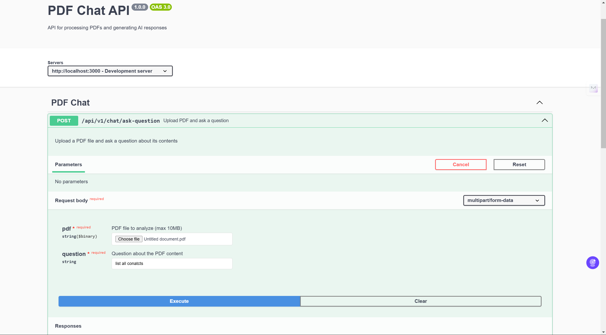
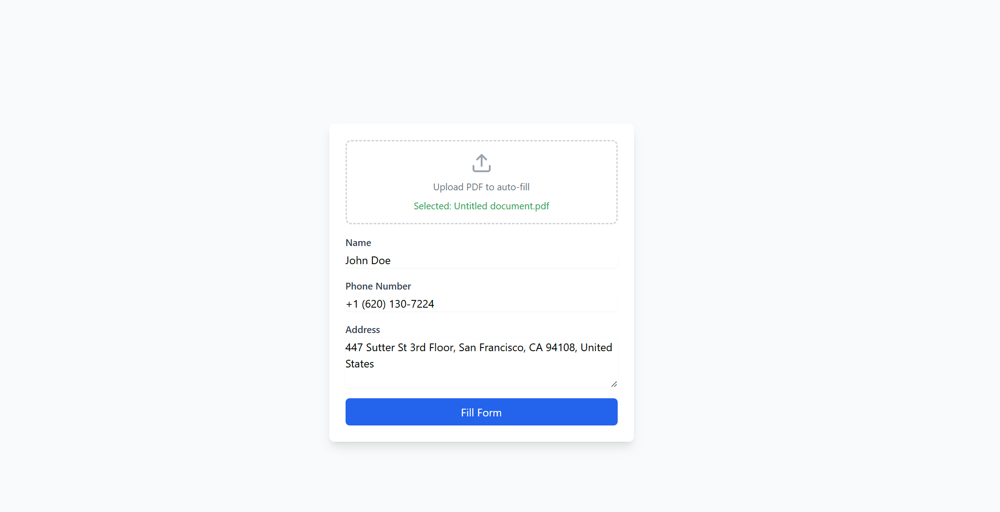

# Project Documentation

## Overview
This project is a full-stack application with separate frontend and backend implementations. Below are the details for running, accessing, and understanding the project.

## Folder Structure
- **Frontend**: Contains the client-side code for the application.
- **Backend**: Contains the server-side code, including APIs and Swagger UI documentation.

---

## Installation and Setup

### Prerequisites
- Node.js installed on your system
- npm (Node Package Manager)

### Steps to Run the Project

#### Backend Setup
1. Navigate to the backend folder:
   ```bash
   cd backend
   ```
2. Install dependencies:
   ```bash
   npm install
   ```
3. Start the server:
   ```bash
   npm start
   ```
4. Access the Swagger API documentation at:
   ```
   http://localhost:3000/api-docs
   ```

#### Frontend Setup
1. Navigate to the frontend folder:
   ```bash
   cd frontend
   ```
2. Install dependencies:
   ```bash
   npm install
   ```
3. Start the development server:
   ```bash
   npm run dev
   ```
4. Access the frontend application at:
   ```
   http://localhost:5173
   ```

---

## API Documentation
The Swagger UI is available at the following endpoint:
```
http://localhost:3000/api-docs
```
This provides comprehensive documentation for all the backend APIs, including their endpoints, request methods, required parameters, and response structures.

---

## Screenshots
To provide a better understanding of the project, include the following screenshots:





---


