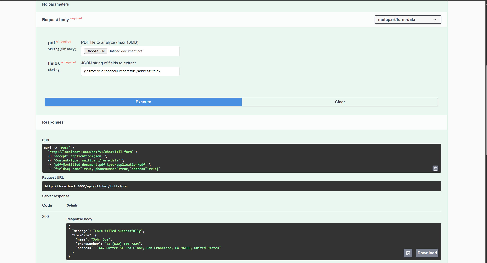

# Project Documentation

## Overview
This project is a full-stack application that enables automatic form filling through PDF document processing. The application consists of a React-based frontend for file uploads and form display, and a Node.js backend that processes PDF documents and extracts relevant information.

## Folder Structure
- **Frontend**: Contains the React application with form components and PDF upload functionality
- **Backend**: Contains the PDF processing API and Swagger UI documentation

---

## Installation and Setup

### Prerequisites
- Node.js installed on your system
- npm (Node Package Manager)

### Steps to Run the Project

#### Backend Setup
1. Navigate to the backend folder:
   ```bash
   cd backend
   ```
2. Install dependencies:
   ```bash
   npm install
   ```
3. Start the server:
   ```bash
   npm start
   ```
4. Access the Swagger API documentation at:
   ```
   https://taskapi.devguy.live/api-docs
   ```

#### Frontend Setup
1. Navigate to the frontend folder:
   ```bash
   cd frontend
   ```
2. Install dependencies:
   ```bash
   npm install
   ```
3. Start the development server:
   ```bash
   npm run dev
   ```
4. Access the frontend application at:
   ```
   https://task.devguy.live
   ```

---

## API Documentation

### PDF Processing Endpoint
- **URL**: `/api/v1/chat/fill-form`
- **Method**: POST
- **Content-Type**: multipart/form-data
- **Request Body**:
  - `pdf`: PDF file to be processed
  - `fields`: JSON string specifying required fields (Name, Phone, Address, Role)
- **Response**: JSON object containing extracted form data

The complete Swagger UI documentation is available at:
```
https://taskapi.devguy.live/api-docs
```

---

## Features

### Frontend
- PDF file upload with validation
- Automatic form filling based on PDF content
- Real-time form validation
- Interactive user interface with loading states
- Error handling and user feedback

### Backend
- PDF text extraction and processing
- Field mapping and data extraction
- Error handling and validation
- Swagger documentation for API endpoints

---

## Usage Instructions

1. **Upload PDF**
   - Click the upload area or drag and drop a PDF file
   - System validates the file type and size

2. **Auto-Fill Process**
   - Click "Fill Form" button to process the PDF
   - System extracts information from the PDF
   - Form fields are automatically populated with extracted data

3. **Manual Editing**
   - All auto-filled fields can be manually edited if needed
   - Form validates input as you type

4. **Error Handling**
   - System displays clear error messages for invalid files
   - Network errors and processing failures are properly handled

---

## Technical Implementation

### Frontend Components
- Form component with controlled inputs
- File upload handler with drag-and-drop support
- Error boundary for graceful error handling
- Loading states and animations

### Backend Services
- PDF processing service
- Text extraction and analysis
- Field mapping logic
- Error handling middleware

---

## Screenshots
To provide a better understanding of the project, include the following screenshots:




---

## Troubleshooting

Common issues and solutions:

1. **PDF Upload Fails**
   - Ensure PDF file size is within limits
   - Check file format is correct
   - Verify network connection

2. **Form Fields Not Filling**
   - Confirm PDF contains readable text
   - Check if fields are properly formatted in the document
   - Verify API connection is working

3. **API Connection Issues**
   - Verify backend server is running
   - Check API endpoint configuration
   - Confirm network connectivity

---

## Support

For additional support or bug reports, please contact:
- Email: ravi848101mnb@gmail.com
- API Documentation: https://taskapi.devguy.live/api-docs
- Frontend Application: https://task.devguy.liv